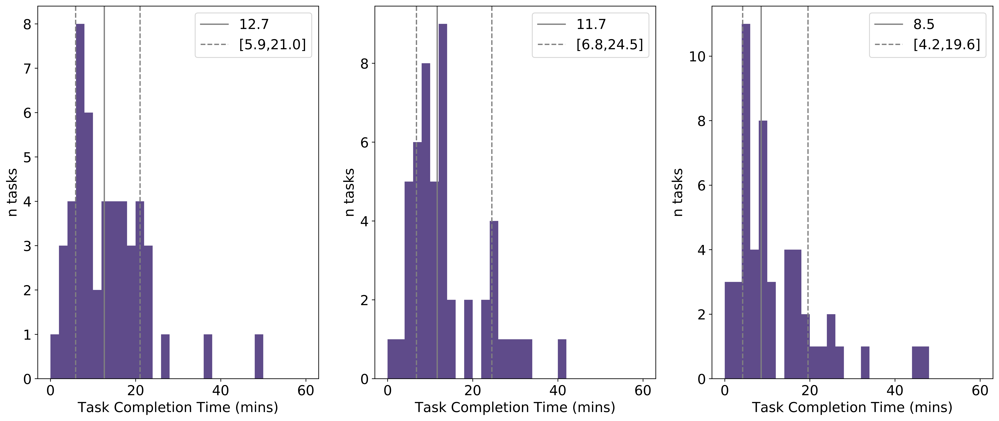

# Distribution-free Tolerance Intervals

In this README and accompanying notebook I'll explain some functions I wrote for calculating distribution-free tolerance intervals (which you can find in [this python file](https://github.com/Yoyodyne-Data-Science/distribution-free-intervals/blob/master/dist_free_intrvls.py)). Almost all the equations in those functions are directly reproduced from the excellent book *'Statistical Intervals A Guide for Practitioners and Researchers'* by William Q. Meeker, Gerald J. Hahn, Luis A. Escobar (Wiley, 2017), predominantly Chapter 5 (*Distribution-Free Statistical Intervals*). Before going into detail on these equations and their applications, let's provide a clear example where distribution-free tolerance intervals are required.

## Example: Estimating the time taken to complete a task

For our example, let's consider the time taken to complete some task. We'll imagine there's one worker (or a series of workers with identical competencies at completing the task) who completes a number of these tasks in a given time. We have at our disposal then a sample of task completion times, and this sample is taken from an *a priori* unkown distribution of task completion times. Although the exact pdf for task completion times for this task is not known to us, we know that, in general it will look something like this:

  

The features I want to draw attention to in this plot are the following:

- The distribution has a clear peak (it's somewhere around 8 mins in this example). This tells us that the task has a typical completion time associated with it, and a large number of tasks are completed in a window containing this peak
- The distribution has a long tail. This tells us that, infrequently, tasks can take a lot longer to complete than expected. For example there might be some complication which means a particular task in our sample took longer to complete than it typically would.
- The distribution only covers the positive half of the time axis. That is, tasks take a finite amount of time to complete.

This third point may seem trivial, but many distributions, including the normal distribution have support from -&#8734; to +&#8734;, so we should always be wary when invoking them in such situations: the probability for completing a task in any time < 0 must equal 0. 

N.B. You'll notice in the notebook, that I generated this data by sampling from an Erlang distribution. I'll discuss this distribution a little later, but for now all that's important is that it generates data with the three properties listed above.

## Task completion statistic

Given the above data, we'd like to provide a statistic on the task completion time. Typically, given some sample, we'd calculate the mean and standard deviation and that would be that. Let's calculate these properties and overlay them on the plot above:

  

This image should sound some alarm bells about the validity of simply quoting &#956; ± &#963; (i.e. mean ± standard deviation). The mean is shifted to the right due to the long tail, leading to a value which isn't indicative of the time it typically takes to complete this task. Moreover, the symmetric nature of &#956; ± &#963; belies the fact that completion times are much more likely to occur in a window &#956;-&#963;<*t*<&#956; than in the period &#956;<*t*<&#956;+&#963;. Furthermore, if we require more certainty in our statistic by quoting 2&#963; bounds on the mean we get into huge trouble as &#956;-2&#963; stretches into the negative part of the time axis!

## Summary statistics for non-normal distributions

The previous section convinced us that quoting &#956; ± &#963; for a non-symmetric pdf with support for only positive values of the random variable, was of little value. But why the obsession with this window of plus-minus one standard deviation around the mean? Let's refresh our knowledge of the normal distribution with the aid of the plot below: 

  

We see that (approximately) 68% of the probability density is contained within the interval &#956; ± &#963;. In other words, we can say that the 68% *Confidence Interval* for the mean of this distribution is &#956; ± &#963;. As we increase the interval (becoming more conservative in our estimate) we capture a greater density of probability, e.g. approximately 95% and 99.7% for &#956; ± 2&#963; and &#956; ± 3&#963;, respectively. This gives us an alternative interpretation for the standard &#956; ± &#963; statistic; it defines the (narrowest possible) interval which contains 68% of the population. Perhaps then, instead of focussing on means and standard deviations, we can ask the question *What is the (narrowest possible) interval containing n% of the population?* Such a statistic makes no assumption about the symmetry or support of a pdf. Concretely, we are consciously moving away from using *Confidence Intervals* (i.e. a window containing a characteristic of the sampled population -- e.g. the mean -- with a given confidence) as our statistic of choice to a *Tolerance Interval* (i.e. a window containing a given proportion of the sampled population). 

N.B. the slightly pedantic inclusion "narrowest possible" in the preceding paragraph. For a given probability distribution *P(x)*, there are an infinite number of choices of *x**1* and *x**2* s.t. &#8747;*P*(*x**1*<x<*x**2*) = n (for example if we want a fraction 0.68 of the population covered, we could simply choose *x**1* = 0, *x**2* = `any_scipy_continuous_random_variable.ppf(0.68)`). **The most pertinent choice is the one which minimizes *x**2* &#8722; *x**1***.

## Task completion statistic revisited

Ok so with this in mind, let's return to our task completion data. Now instead of calculating a mean and a standard deviation, we're going to look for an interval which contains 68% of the population. As mentioned above there are infinitely many ways of choosing this interval, so let's try to make a relatively sensible choice for the end points, namely the 0.16 and 0.84 quantiles:

  

Ok great, this looks like a much more sensible way of characterizing the data, concretely we can say that a fraction 0.68 of tasks are completed between approximately 5 and 23 minutes.

## Less Data

In the above example, we had lots of data points, therefore our sample looked very similar to the underlying distirbution (which, as we mentioned, we typically don't have access to). But in practice, we'll often be dealing with small samples (the median task length here for example is 12 minutes, so even if a worker only performed this task for an entire week, we'd still only have approximately 200 datapoints) how does this affect our description statistic?

Let's imagine we only have 50 completed tasks to make our estimate on. To simulate this, I'll sample 50 times from the Erlang distribution I used earlier, moreover, as I have the luxury of knowing what the underlying distribution is, I'll do this sampling 3 times. The results are shown below:

  

As we can see, with fewer datapoints, the underlying pattern of task completion time is a lot harder to deduce. For each of the examples I've again calculated the median and the 68% confidence interval, but you'll notice that these are typically different for each sampling. In a real life situation, we'll only get to see one of these datasets, how then can we make meaningful summary of the underlying distribution if the quantiles we calculate change with each sampling?!

## A Stricter Definition of Tolerance Intervals

When the distribution is known, we can simply calculate the mean and its desired confidence intervals directly. For example, as we saw above when considering the normal distribution, we could say that the mean was contained in the interval &#956; ± &#963; with 68% probability. If the sample taken from a distribution is so large that it is a good proxy for the underlying distribution, then simply computing the quantiles of interest on the sample is sufficient to say something meaningful about the data. That is, we can be confident that, were we to take a similar sample, we'd get similar values for these quantiles. 

This concept of *confidence* in the intervals is key. When we had a large sample, we were confident that the interval we derived from it would apply to the next bunch of tasks completed. Conversely, when we had a small number of samples, the intervals we calculated for one sample didn't describe the next. When we introduced the concept of tolerance intervals earlier we defined them as *a window containing a given proportion of the sampled population*, however, the full definition should be something like *a window containing a given proportion of the sampled population* **with a given confidence**. That is, how likely is it, when we sample the distribution again that the tolerance interval will contain at least the desired proportion of the sampled population. 

With this definition, our departure from the world of means and standard deviations as our summary statistics is complete. Instead of quoting some value as having *mean &#956; and standard deviation &#963;*, we'll instead say something like *a proportion &#946; of the population lies within the interval [Tl, Tu] with confidence p*.

## Calculating Distribution-free Tolerance Intervals

The method of calculating such tolerance intervals is described in great detail in the aforementioned *'Statistical Intervals A Guide for Practitioners and Researchers'* by William Q. Meeker, Gerald J. Hahn, Luis A. Escobar (Wiley, 2017). Only a brief summary is included here.

As a point of notation, we define  *x**i* as the *i*th sample randomly drawn from some distribution *P(x)*, or equivalently the *i*th measurement of some variable *x*. We differentiate this from *x**(i)* which corresponds to the *i*th smallest value in our sample of *x*'s (see [order statistic](https://en.wikipedia.org/wiki/Order_statistic)). The tolerance interval containing at least a proportion &#946; of the sampled distribution from a sample size *n* is then given by:

where *l* and *u* are generally chosen symmetrically or nearly symmetrically within the ordered sample data to provide, if possible, the desired coverage probability. The coverage probability for this distribution-free tolerance interval (CPTI) procedure is then:

You can find the full derivation of this equation in the appendix of the aforementioned textbook. You'll notice that this is the pdf of the Binomial distribution, specifically the probability of *u-l-1* successes after *n* Bernoulli trials with probability of success &#946;. This allows us a hand-wavy justification of the above; *u-l-1* is the number of samples lying between *x**(l)* and *x**(u)*, so we're asking what's the probability that this many of our *n* samples lie within the tolerance interval, given that the probability of lying within the interval is just &#946;, i.e. the proportion of the distribution.

## A little more to say on Distribution-free Tolerance Intervals

The formula above has a tendency to be too conservative, giving a CPTI higher than that desired, by interpolating the between the tolerance intervals achieved for [*x**(l)*, *x**(u)*] and those for [*x**(l+1)*, *x**(u-1)*] we can reach a tolerance interval which has the desired &#946;, and a CPTI closer to the one specified. The details of the calcuation are given on page 87 of *'Statistical Intervals A Guide for Practitioners and Researchers'* for those interested, I will not give details here, though I have included this interpolation method in my [python functions](https://github.com/Yoyodyne-Data-Science/distribution-free-intervals/blob/master/dist_free_intrvls.py). Note that when interpolation is not possible on either the upper or lower tolerance bounds, an error message is displayed, and the calculation of that bound is made without interpolation.

Earlier, we were discussing the importance of sample size in determining how confident we were in setting our intervals. The method above allows us to turn this question on its head and ask *What is the smallest sample size required to specify a tolerance interval which covers a given proportion of the distribution with a specified confidence?* Concretely, we find the answer to be the value of *n* which solves the following:

where 100(1 - &#945;)% is a somewhat standard notation for confidence, and &#946; is the proportion of the distribution. For example, to obtain a 95% confidence interval to contain at least a proportion 0.99 of the distribution a minimum of n = 473 observations are needed. The code for calculating the minimum required number of samples is included in my [python functions](https://github.com/Yoyodyne-Data-Science/distribution-free-intervals/blob/master/dist_free_intrvls.py). Note that if the sampled data is too small to give a tolerance interval of the desired confidence, an error message is shown and an interval of [0,0] is returned.

## Let's calculate some Tolerance Intervals

In the following, we'll calculate the tolerance intervals to contain a proportion 0.68 of the sampled population with 95% certainty. We’ve chosen 95% as it’s kind of standard, and captures a high degree of certainty though any percentage (90%, 99%, 99.9999%, …) can be chosen. 

First let's consider our sample with a large number of data points which we considered initially:

  

As we might've guessed, the quantiles (grey) and tolerance interval (sky blue) essentially overlap. The difference between sample quantiles and tolerance intervals is that the former tells us about a particular sample, whereas the latter tries to say something about the entire distribution. So in the case of large *n* where the sample mimics the underlying distribution very well, we'd expect the quantiles and tolerance intervals to overlap.

Now let's have a look at some randomly generated, smaller sample sizes: 

  

Now we see a disparity between the quantiles and the calculated tolerance interval; the former is over-confident as bounds are simply chosen from the sample, whereas the latter takes into account that, with a small sample size, we can't deduce too much about the underlying population.

## A word on the Erlang distribution

As I mentioned, to generate the task time "data" above, I sampled from an [Erlang distribution](https://en.wikipedia.org/wiki/Erlang_distribution). Given that the problem at hand was concerned with task completion times, one might think that a [Poisson distribution](https://en.wikipedia.org/wiki/Poisson_distribution) could be invoked by framing the problem as "what's the probability of *k* tasks being completed in time *t*". However, the Poisson distribution is derived by assuming a sequence of identical, independent, randomly occuring processes, with the probability of a single process occuring as a function of time being given by an exponential decay curve. This reasoning doesn't really fit for us, as we'd imagine that after completing one task, it will most likely take some time (e.g. the median task completion time) until the next is completed.

Having said that, I can't give a good explanation of why an Erlang distribution makes sense to use here (though, see a super hand-wavy explanation in an answer [here](https://stats.stackexchange.com/questions/109566/which-distribution-for-modelling-duration-of-tasks)). In truth, any number of distributions (e.g. [log-normal](https://en.wikipedia.org/wiki/Log-normal_distribution), [Weibull](https://en.wikipedia.org/wiki/Weibull_distribution), [Gamma](https://en.wikipedia.org/wiki/Gamma_distribution)...) can be chosen to give similar looking results. My advice in general would be to make as few assumptions as possible about the underlying distribution you're sampling from, and to use the distribution-free methods described above and included in [this python code](https://github.com/Yoyodyne-Data-Science/distribution-free-intervals/blob/master/dist_free_intrvls.py) as opposed to making inferences based on assuming a specific distribution.