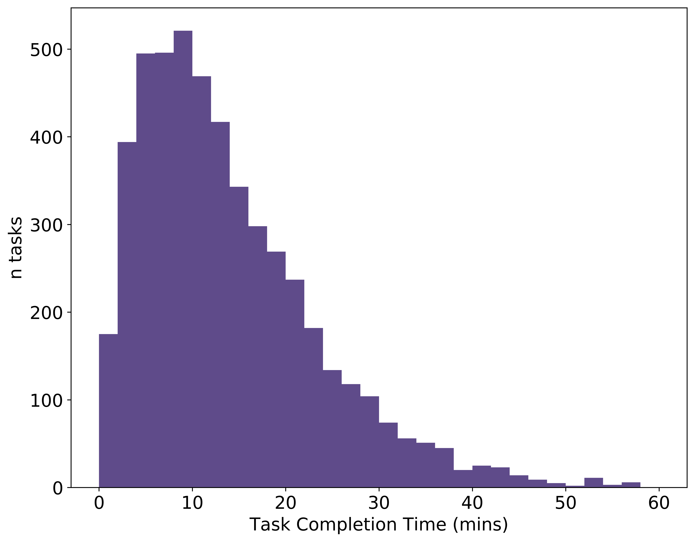

# Distribution-free Tolerance Intervals

In this README and accompanying notebook I'll explain some functions I wrote for calculating distribution-free tolerance intervals. Almost all the equations in those functions are directly reproduced from the excellent book *'Statistical Intervals A Guide for Practitioners and Researchers'* by William Q. Meeker, Gerald J. Hahn, Luis A. Escobar (Wiley, 2017), predominantly Chapter 5 (*Distribution-Free Statistical Intervals*). Before going into detail on these equations and their applications, let's provide a clear example where distribution-free tolerance intervals are required.

## Example: Estimating the time taken to complete a task

For our example, let's consider the time taken to complete some task. We'll imagine there's one worker (or a series of workers with identical competencies at completing the task) who completes a number of these tasks in a given time. We have at our disposal then a sample of task completion times, and this sample is taken from an *a priori* unkown distribution of task completion times. Although the exact pdf for task completion times for this task is not known to us, we know that, in general it will look something like this:

  

We'd like to provide some statistic which describes how quickly the task is being completed. 